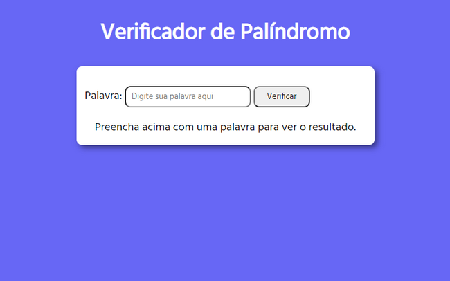
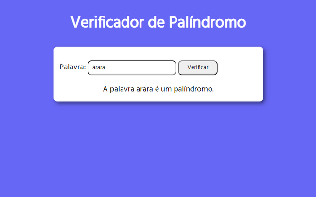
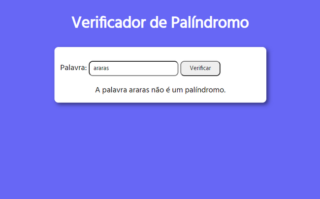

# Atividade 01

## Verificador de Palíndromo

O exercício em questão envolve verificar se a palavra digitada se trata de um palíndromo ou não. 

Para a verificação, alguns parâmetros deverão ser seguidos:

- Deverão ser digitados no mínimo 3 caracteres;
- Não poderão ser digitados apenas números;
- Apenas letras ou letras e números.

## Imagens

### Tela inicial

### Quando *for* um palíndromo

### Quando *não for* um palíndromo

## O que é um Palíndromo?

Segundo o [Wikipedia](https://pt.wikipedia.org/wiki/Palíndromo):

>Palíndromo é uma palavra, frase ou número que permanece igual quando lida de trás para diante".

Quadrado Sator, uma das mais famosas representações de Palíndromo. Fonte: Wikipedia