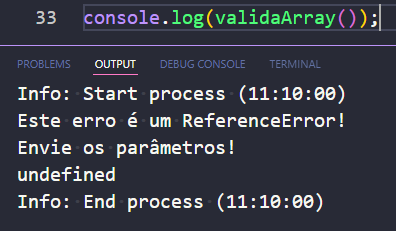
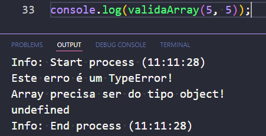
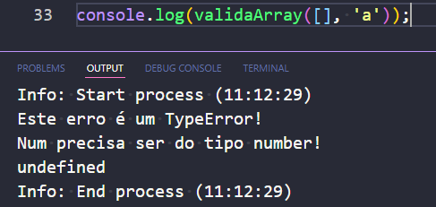
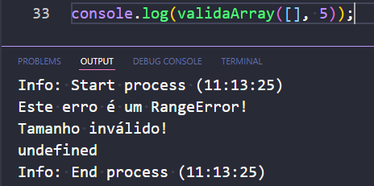
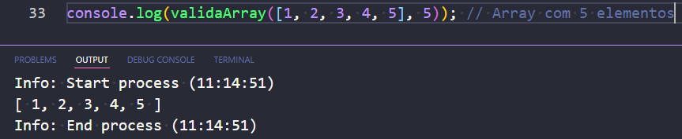

# Atividade 02

## Tratamento de Erros (validação de erros por tipo)

O objetivo é que a função receba um array e retorne ele caso o seu tamanho corresponda ao número enviado como parâmetro na função. Caso contrário, um erro será lançado.

## `ReferenceError` (quando os *parâmetros* não forem enviados)

Clique aqui!

## `TypeError` (se o array não for do tipo *object*)

Clique aqui!

## `TypeError` (se o array não for do tipo *number*)

Clique aqui!

## `RangeError` (quando o *tamanho* do array não coincidir com o *número* enviado como parâmetro)

Clique aqui!

## Caso tudo esteja correto, ele irá retornar o array

Clique aqui!

