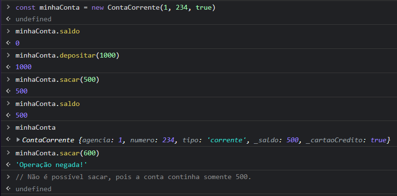
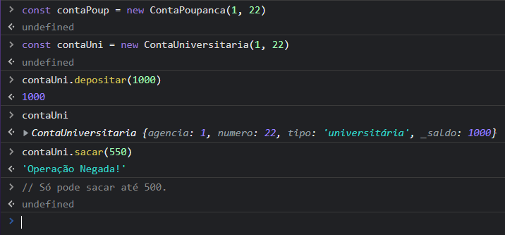

# Atividade 04

## Orientação a Objetos

Atividade que utiliza de práticas relacionadas a orientação a objetos, herança, polimorfismo, classe super, getters e setters, além de sobrescrever métodos.

É possível compreender melhor sua utilização por meio do console do navegador.

## Imagens

Na imagem abaixo temos os comandos da "minhaConta", inicialmente definindo como "ContaCorrente", com os parâmetros de Agência (1), Número (234) e se quer ou não adquirir um cartão (*true* indica que queremos o cartão) onde é possível ver o `saldo`, `depositar`, `sacar`, além do limite de saque em 500, ou seja, ao tentar sacar acima desse valor (600 por exemplo), um erro irá aparecer.

Já com relação a "contaUni" temos como parâmetros iniciais a Agência (1) e o Número (22), em seguida os comandos para `depositar`, e `sacar`, demonstrando que o saque só é possível para valores até 500.

