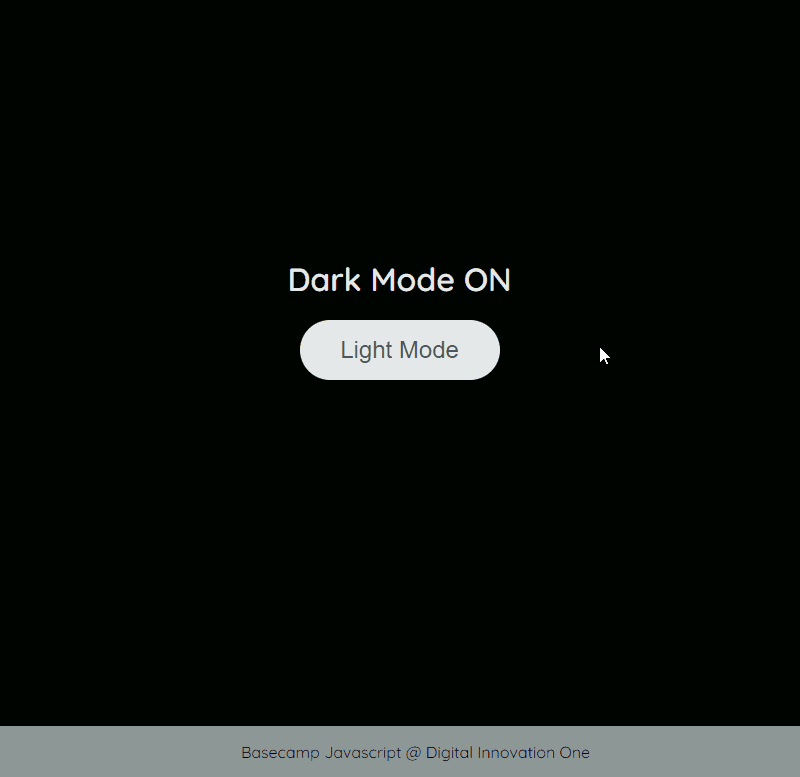

# Atividade 05

## Light Mode/Dark Mode

A atividade tem como foco apresentar a Manipulação de D.O.M (*Document Object Model*) e a adição de eventos para a alteração entre Modo Light e Dark.

## Como funciona?

Ao apertar o botão, ele irá alterar entre os modos Light e Dark, e com isso, é possível verificar as mudanças na estrutura principal do site, no botão, no título acima dele e no rodapé da página.

